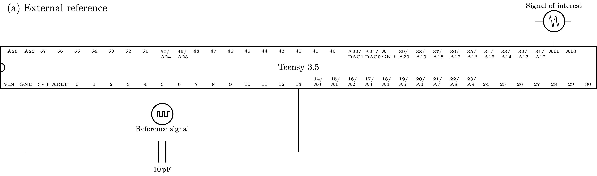
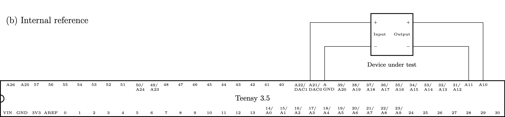
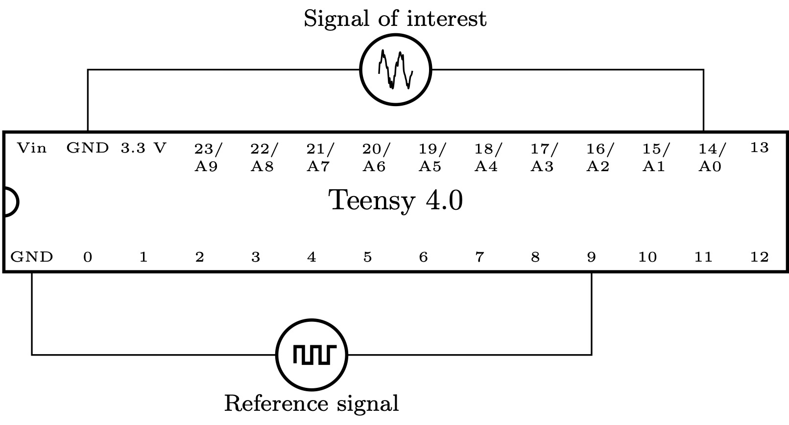

# Hardware Connections

## [Teensy 3.5](https://www.pjrc.com/store/teensy35.html)

teensy_lockin uses the Teensy 3.5's differential pins, A10 and A11, to digitize the signal of interest. The differential signal is given by A10 - A11. These are located on the back side of the Teensy 3.5. If you want to use header pins to connect your Teensy 3.5 to a solderless breadboard, solder socket headers to the A10 and A11 through holes to access those pins from the top.

The digital pins on a Teensy 3.5 are 5 V tolerant. However, A10 and A11 are *not* 5 V tolerant and should be driven no higher than 3.3 V. A10 and A11 only handle signals between 0 and 3.3 V; signals are digitized with 12 bits of resolution.

###  External reference mode

See the figure below:

teensy_lockin uses the FreqCount library to measure the frequency of an external reference signal (assumed to be a logic-level square wave). Connect the external reference signal to pin 13, the only pin that works with FreqCount. It may be necessary to connect a small bypass capacitor (10 pF) to avoid spurious ringing.

### Internal reference mode

See the figure below:

Connections to the signal of interest are the same as in external reference mode. teensy_lockin uses the pins DAC0 and DAC1 (A21 and A22) to generate a sinusoidal reference signal.

## Teensy 4.0

Only external reference mode is currently supported for Teensy 4.0 because the Teensy 4.0 does not have onboard digital-to-analog conversion. In addition, all of the pins on the Teensy 4.0 are 3.3 V tolerant only.

As shown in the figure below, using FreqCount on Teensy 4.0 requires the external reference signal to be connected to pin 9. The signal of interest is connected to A0.

Note that a 5 V square wave reference signal cannot safely be directly connected to the Teensy 4.0. While there are many ways to step the reference signal down (a simple resistive divider may be adequate for slow signals), an easy-to-use integrated circuit that can reliably perform this task is the [74LVC245](https://www.ti.com/lit/gpn/sn74lvc245a). While not shown in the figure, a capacitor may be needed across pins 9 and ground to quiet spurious analog ringing.
