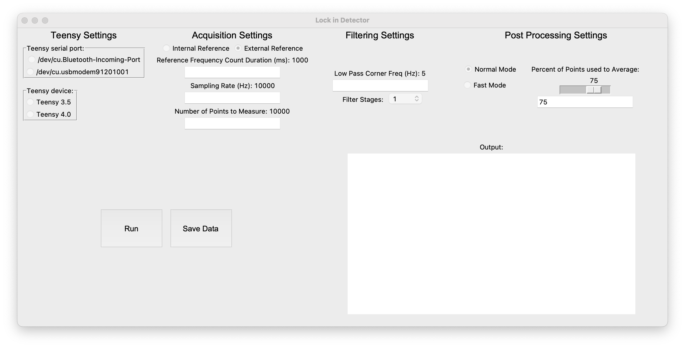

# Software

## Teensy sketch

In order to perform phase-sensitive detection with a Teensy, a user only needs to compile and upload the sketch `teensy_lockin.ino` to their Teensy. No further direct interaction with the Teensy sketch is needed. If you are interested in more details about how the sketch works, please see the *American Journal of Physics* paper.

## Graphical user interface (GUI)

Prior to launching `teensy_lockin_gui.py`, connect your Teensy to your computer via USB.

### Before collecting data

Here is a screenshot of the user interface:

You'll need to make choices in the panels at the top of the screen, although many options have sensible defaults.

#### Teensy Settings

Choose the serial port to which your Teensy is connected. When the GUI starts up, it scans the available serial ports, which is why you should have your Teensy connected first. If you are having difficulty identifying which port is connected to your Teensy, using the features of the Arduino IDE may be helpful.

You'll also need to choose the model of Teensy you're using. (This affects how the data returned from the Teensy are scaled to from 10 or 12-bit values to volts.)

#### Acquisition Settings

First, select whether you want to use *External Reference* or *Internal Reference* mode. (In *Internal Reference* mode, which is only implemented for Teensy 3.5, the Teensy generates a sinusoidal reference signal varying between 0 and 3.3 V at a user-selectable frequency. In *External Reference* mode, you need to connect a square wave (0-3.3 V, although a Teensy 3.5 is 5 V-tolerant) to the appropriate pin as described in the [hardware documentation](./hardware.md).

In *External Reference* mode, the Teensy detects the number of rising edges in the reference signal during a user-selectable interval (*Reference Frequency Count Duration*).

If you select *Internal Reference* mode, you will instead specify the desired reference frequency.

You can also set the *Sampling Rate* at which the signal of interest is digitized, as well as the number of samples to acquire (*Number of Points to Measure*).

#### Filtering Settings

After the digitized signal is mixed with the reference signal, it is low-pass filtered. Here, select the corner frequency for the low-pass filter (*Low Pass Corner Frequency*) as well as the number of filter stages to use (*Filter Stages*). Note that the corner frequency applies to *each stage* of the filter, which is not the same as the complete filter if using more than 1 stage.

#### Post Processing Settings

In *Normal Mode*, the complete digitized signal as well as the output of phase-sensitive detection (including the amplitude and phase) are returned to the host computer, as well as average values of the amplitude and phase. In *Fast Mode*, only the average values are returned. The slider controls the fraction of the collected points that are used to compute the averages (namely, the last *n*% of the points, where *n* is the value set by the slider).

#### Collecting data

Click *Run* to begin data collection. Note that in external reference mode, the Teensy will first monitor the reference signal for the user-specified period before digitizing the signal of interest.

### After collecting data

If you are using *Fast Mode*, the results will be displayed in the output window at the lower right.

In *Normal Mode*, graphs of the raw digitized signal, the output amplitude, and the output phase will also automatically be displayed, in separate windows.

In addition, in *Normal Mode*, click the *Save Data* button to save the collected signals as a CSV file.
